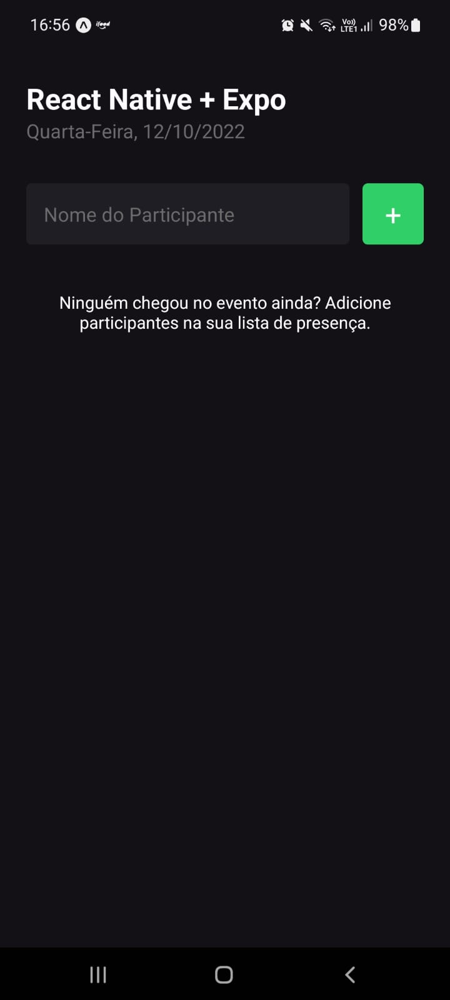
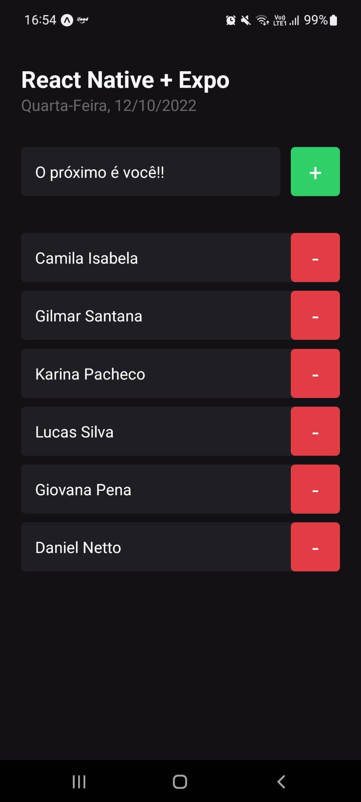
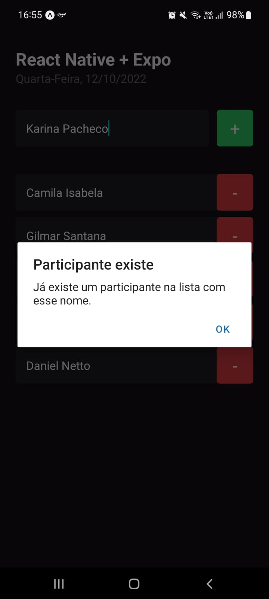

<h1 align="center" style="font-size:3.4rem">I'm Here<h1>

<h2 align="center">
<a href="#about">About</a>  |
<a href="#status">Status</a>  |
<a href="#preview">Preview</a>  |
<a href="#technologies">Technologies</a>  |
<a href="#contribute">Contribute</a>  | 
</h2>

<h2 id="about">🏷 About The Project</h2>

Application to manage attendees at events such as lectures and workshops. The technologies used were Javascript, Typescript, React Native and the Expo development tool.

<h2 id="status"> 🚦Status </h2>
<h4 align="center"> 
	🚀 Done! Waiting for features...  🚧
</h4>

### Goals

- [x] FlatList x ScrollView
- [x] StatusBar
- [x] Add item
- [x] Remove item
- [x] Breakpoints
- [x] Debugger
- [x] UseState
- [x] Immutability

<h2 id="preview">🔎 Preview </h2>

      
<h3>AppMobile</h3>

<h2 id="technologies">🧰 Used Technologies </h2>

&nbsp;&nbsp;&nbsp;
&nbsp;&nbsp;&nbsp;
&nbsp;&nbsp;&nbsp;
&nbsp;&nbsp;&nbsp;  

<h2 id="contribute">🖇 Contribute</h2>

    💡 Explore your creativity and skills
    📥 Make a fork
    🔱 Create a branck with your feature
    〽 Commit changes
    💠 Make a push to your branch

<h3>&nbsp;That's it! 🖖</h3>

Try and miss again until its works.&nbsp;

